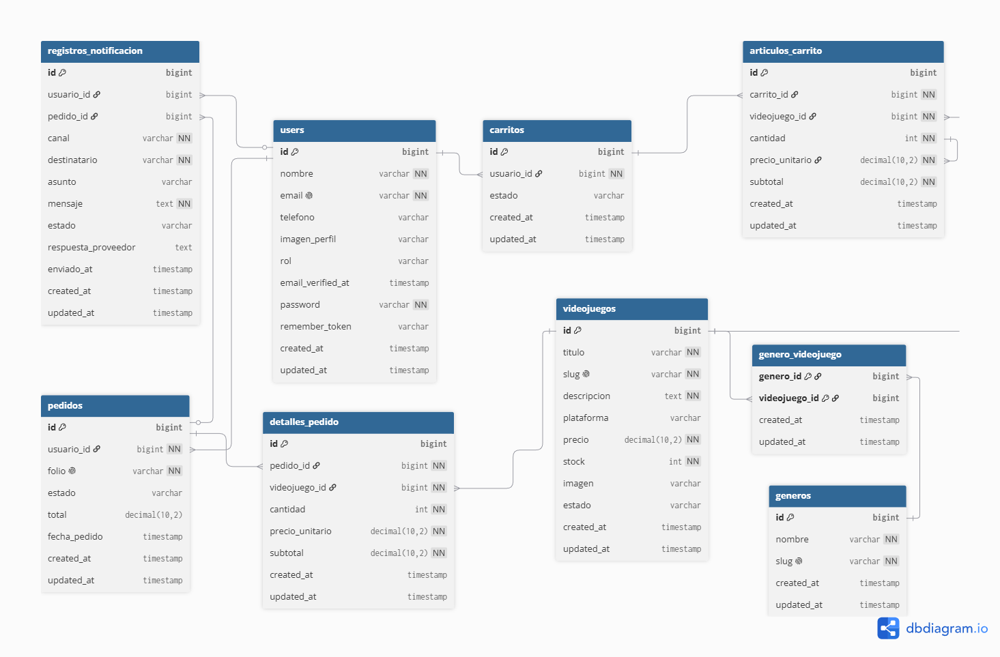

# GameWolf

GameWolf es nuestro proyecto web para administrar y vender videojuegos de una forma más ordenada. La idea nació porque muchas tiendas llevan sus productos, clientes y pedidos de forma manual o en diferentes herramientas, y eso puede causar errores en el inventario, en las ventas o en el seguimiento de los pedidos.

Con GameWolf buscamos que una tienda pueda tener en un solo lugar su catálogo de videojuegos, sus usuarios, sus pedidos, su carrito de compras y sus notificaciones.

## Integrantes

- Luis Jared García García
- Leonardo Fuentes López

Equipo número 8.

## ¿Qué problema resuelve?

GameWolf ayuda a una tienda de videojuegos a controlar mejor sus productos y ventas. Los administradores y empleados pueden revisar el catálogo, registrar videojuegos, atender pedidos y consultar clientes. Los clientes pueden entrar al sistema, ver los videojuegos disponibles, agregarlos al carrito, confirmar una compra y revisar el estado de sus pedidos.

También se está trabajando la comunicación con el cliente mediante correo electrónico y WhatsApp, para que el usuario pueda recibir avisos importantes relacionados con su cuenta o sus compras.

## Tecnologías utilizadas

- **Backend:** PHP y Laravel, con API REST, Eloquent, Form Requests y Laravel Sanctum.
- **Frontend:** React, Vite, JavaScript, CSS y consumo de API mediante Fetch.
- **Base de datos:** MySQL, migraciones, seeders y respaldo SQL.
- **Comunicación:** Gmail SMTP para correos y Twilio WhatsApp para avisos de pedidos.
- **Pruebas:** Bruno para probar endpoints de la API y PHPUnit para pruebas del backend.
- **Despliegue:** VPS con Nginx, HTTPS y certificado SSL de Let's Encrypt/Certbot.
- **Control y diseño:** Git, GitHub, GitHub Projects y Figma.

## Roles del sistema

### Administrador

Es el usuario con más permisos dentro del sistema. Puede administrar videojuegos, géneros, usuarios, clientes, pedidos y reportes. También puede cambiar estados de pedidos y revisar la información general de la tienda.

### Empleado

Apoya en la operación diaria de la tienda. Puede consultar videojuegos, clientes y pedidos. También puede actualizar el estado de los pedidos, pero no puede administrar usuarios ni entrar a configuraciones del sistema.

### Cliente

Es quien compra dentro de la plataforma. Puede registrarse, iniciar sesión, consultar el catálogo, agregar videojuegos al carrito, confirmar compras, revisar sus pedidos y editar su perfil.

## Módulos principales

### Videojuegos

Permite registrar, editar, eliminar y consultar videojuegos. Cada videojuego maneja título, descripción, precio, stock, imagen, plataforma y géneros.

### Géneros

Permite administrar categorías como acción, aventura, carreras, RPG, deportes, entre otras. Estos géneros se pueden asignar a los videojuegos para organizar mejor el catálogo.

### Carrito de compras

Permite que el cliente agregue videojuegos antes de confirmar su compra. Se pueden modificar cantidades, quitar productos y ver el total.

### Pedidos

Guarda las compras realizadas por los clientes. Cada pedido tiene cliente, fecha, estado y total. El administrador o empleado puede cambiar el estado del pedido.

### Detalle del pedido

Guarda los videojuegos que forman parte de cada pedido, junto con su cantidad, precio y subtotal.

### Usuarios

Permite registrar cuentas para administrador, empleado y cliente. Cada usuario tiene nombre, correo, contraseña, rol, teléfono e imagen de perfil.

### Reportes

Muestra información general de la tienda, como ingresos, pedidos por estado, pedidos de hoy y productos con bajo stock.

## Diseño en Figma

El diseño visual del sistema se trabajó en Figma para mantener una idea clara de cómo debía verse la aplicación. Se buscó una identidad tipo gamer, usando colores oscuros, azul brillante y morado para transmitir tecnología, energía y relación con videojuegos.

- Diseño en Figma: [abrir archivo](https://www.figma.com/design/0p9So8xH9ZgsdcE6qDolP7/Sin-t%C3%ADtulo?node-id=0-1&t=7Aim8pIf3QMfQBgJ-1)
- Prototipo navegable: [abrir prototipo](https://www.figma.com/proto/0p9So8xH9ZgsdcE6qDolP7/Sin-t%C3%ADtulo?node-id=5-85&p=f&t=BnMY9vRQTIQtdCpq-1&scaling=min-zoom&content-scaling=fixed&page-id=0%3A1&starting-point-node-id=5%3A85)

## Paleta de colores

La paleta principal del proyecto usa colores oscuros combinados con azul neón y morado.

- Azul neón: representa tecnología, energía y ambiente gamer.
- Morado: se usa para resaltar botones, estados activos y acciones importantes.
- Negro y azul oscuro: ayudan a que el sistema tenga un estilo más inmersivo y parecido a una interfaz de videojuegos.
- Blanco y gris claro: se usan en el contenido para que la información se lea con claridad.

Esta combinación permite que el sistema se vea llamativo, pero también ordenado para poder trabajar con tablas, formularios y reportes.

## Logo

El logo de GameWolf representa la mezcla entre un lobo y un control de videojuegos. Se eligió esta idea porque el lobo transmite fuerza e identidad, mientras que el control conecta directamente con el tema del proyecto.

## Estructura del proyecto

```text
GAMEWOLF/
  backend/   Parte del sistema que guarda datos y responde las peticiones
  frontend/  Parte visual que usa el usuario en el navegador
  bruno/     Pruebas para revisar las peticiones del sistema
  docs/      Diagramas y documentos del proyecto
  assets/    Imágenes y recursos visuales
```

## Cómo abrir el proyecto en local

Primero se necesita tener XAMPP/MySQL abierto y una base de datos llamada:

```text
gamewolf
```

### Backend

```bash
cd backend
composer install
cp .env.example .env
php artisan key:generate
php artisan migrate --seed
php artisan serve
```

### Frontend

```bash
cd frontend
npm install
npm run dev
```

Si PowerShell bloquea el comando de npm, se puede usar:

```bash
npm.cmd run dev
```

## Usuarios de prueba

Todos usan la misma contraseña:

```text
GameWolf#2026
```

- Administrador: `admin@gamewolf.test`
- Empleado: `empleado@gamewolf.test`
- Cliente: `cliente@gamewolf.test`

## Base de datos

El sistema usa MySQL. Las tablas se crean con los comandos del backend, por eso no es necesario hacerlas manualmente. También se incluye el archivo:

```text
gamewolf.sql
```

Ese archivo sirve como respaldo de la base de datos.

Para reiniciar los datos de prueba en local:

```bash
cd backend
php artisan migrate:fresh --seed
```

## Diagramas

### Diagrama Entidad-Relación


### Diagrama Relacional



## Comunicación con el cliente

El sistema contempla notificaciones para mantener informado al cliente.

Actualmente se trabaja con:

- Correo de bienvenida cuando se registra o se crea una cuenta.
- Recuperación de contraseña por correo.
- Avisos de pedido por WhatsApp cuando cambia el estado de una compra.

Para WhatsApp se dejó preparada la integración con Twilio. Para que funcione de forma real se deben colocar las credenciales correspondientes en el archivo `.env` del backend.

## Avance actual

Hasta el momento el sistema ya cuenta con:

- Inicio de sesión por rol.
- Registro de clientes.
- Recuperación de contraseña.
- Panel para administrador, empleado y cliente.
- Gestión de videojuegos.
- Gestión de géneros.
- Gestión de usuarios.
- Consulta de clientes.
- Catálogo para clientes.
- Carrito de compras.
- Creación y seguimiento de pedidos.
- Reportes básicos.
- Foto de perfil.
- Estados de carga visibles en acciones principales.
- Diseño responsive para computadora y celular.
- Prototipo en Figma.

## Enlaces del proyecto

- Repositorio: [GAMEWOLF](https://github.com/JaredTareas/GAMEWOLF.git)
- GitHub Projects: [tablero del proyecto](https://github.com/users/JaredTareas/projects/1/views/1)
- Diseño en Figma: [archivo de diseño](https://www.figma.com/design/0p9So8xH9ZgsdcE6qDolP7/Sin-t%C3%ADtulo?node-id=0-1&t=7Aim8pIf3QMfQBgJ-1)
- Prototipo en Figma: [prototipo navegable](https://www.figma.com/proto/0p9So8xH9ZgsdcE6qDolP7/Sin-t%C3%ADtulo?node-id=5-85&p=f&t=BnMY9vRQTIQtdCpq-1&scaling=min-zoom&content-scaling=fixed&page-id=0%3A1&starting-point-node-id=5%3A85)
